<!-- the whole profile reads like a terminal; the art below animates once, then freezes -->

<h3><code>jaswanth@github ~ $ ./contributions.sh</code></h3>

  

<h3><code>jaswanth@github ~ $ whoami</code></h3>
<table>
  <tr>
    <td valign="top" width="370"></td>
    <td valign="top" width="490"></td>
  </tr>
</table>

<i>368-day commit streak and counting · refreshed daily by GitHub Actions · no third-party stat services, just SVG</i>

